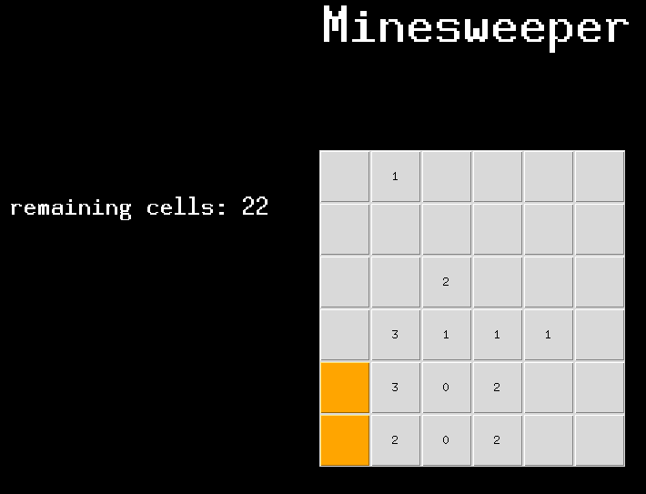
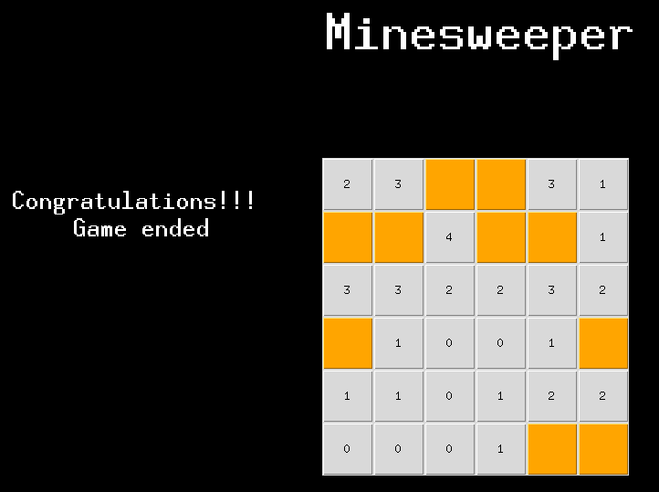

# minesweeper
This repository contains the old minesweeper game rewritten in Python. The number shown inside the cell correlates to the amount of mines in the neighboring cells. If you think you have found a mine, you can mark the cell by a right-click. The color is then changed to orange (see Fig. 1). If you click on a mine, the cell turns red and the game is over (see Fig. 2). If all cells have been opened, you win the game (see Fig. 3).

**Figure 1** - Screenshot during the game.

**Figure 2** - Screenshot after game is lost.

**Figure 3** - Screenshot after game is won.
